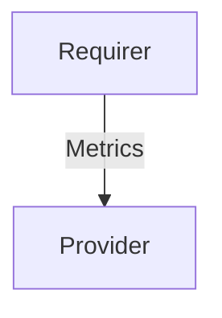

# `prometheus_remote_write/v0`

## Usage

This relation interface describes the expected behavior of any charm claiming to be able to provide or require Prometheus Remote Write data.

In most cases, this will be accomplished using the [prometheus_remote_write library](https://charmhub.io/prometheus-k8s/libraries/prometheus_remote_write), although charm developers are free to provide alternative libraries as long as they fulfill the behavioral and schematic requirements described in this document.

## Direction



As all Juju relations, the `prometheus_remote_write` interface consists of a provider and a requirer. One of these, in this case the `provider`, will be expected to stand up a remote write-compatible webserver where the `Requirer` will be able to send it's metrics.

## Behavior

Both the Requirer and the provider need to adhere to a certain set of criterias to be considered compatible with the interface.

### Provider

- Is expected to provide one or more endpoints for Prometheus remote write in the relation data bag.
- Is expected to be able to ingest alert rules exposed over the relation data bag.
- Is expected to respect the metrics topology set by the requirer.
- Is expected to inject alert rule topology labels as label matchers in alert rule expressions.
- Is expected not to inject juju_unit as a label matcher by default, but to honor it if hard-coded by the user.
- Is expected to be able to ingest both single alert rules and alert rule groups provided over the relation data bag.
- Is expected to advertise the alert rule encodings it can read in `alert_rules_encodings`, if it is able to read any encoding other than plain `json`.
- Is expected to be able to ingest alert rules in any encoding it advertises.
- Is expected to be able to ingest plain `json` alert rules whether or not it advertises `json`, so that rules published by a requirer of any version are never lost.
- Is expected to (re)publish `alert_rules_encodings` on leadership changes and charm upgrades, so that relations established before the provider gained the capability learn about it.
- Is expected to report alert rules it cannot use, whether they failed validation or could not be decoded, in `event.errors` rather than dropping them silently.


### Requirer
- Is expected to be able to push Prometheus metrics to a remote write endpoint
- Is expected to fetch the target configuration from the relation data bag 
- Is expected to push all metrics to every remote write target available in the data bag.
- Is expected to provide alert rules over the relation data bag.
- Is expected to provide any wanted label matchers as labels on every alert rule in the relation data bag.
- Is expected to add any wanted topology labels to all metrics sent to the provider.
- Is expected to be able to expose both single alert rules and alert rule groups over the relation data bag
- Is expected to encode its alert rules as plain `json`, unless the provider advertises support for another encoding in `alert_rules_encodings`.
- Is expected to ignore encodings it does not recognise, and to fall back to plain `json` when it recognises none of the advertised ones.
- Is expected to re-evaluate the encoding whenever the provider's application databag changes, since the provider's advertisement may only arrive after the relation was joined.
- Is expected to serialize its alert rules deterministically, e.g. with sorted keys, so that unchanged rules produce an unchanged databag value and no spurious `relation-changed` is triggered on the provider.

## Relation Data

### Provider

[\[JSON Schema\]](./schemas/provider.json)

Exposes all endpoints the requirer should write metrics to. Should be placed in the **unit** databag for each 
unit of the provider capable of receiving metrics over remote write.

Optionally exposes the alert rule encodings the provider is able to read, so that requirers know
whether they may compress their alert rules, and any problem with the rules a requirer published,
in `event.errors`. Both should be placed in the **application** databag by the leader unit. A
provider that omits `alert_rules_encodings` is assumed to understand plain `json` only.

#### Example

```yaml
related-units:
  some-Requirer/0:
    # ...
    data:
      # ...
      remote_write: {
        "url": "http://192.168.1.2:9090/api/v1/write"
      }
application-data:
  alert_rules_encodings: ["lzma", "json"]
  event: {
    "errors": "error validating rule: could not parse expression"
  }
```

### Requirer

[\[JSON Schema\]](./schemas/requirer.json)

Exposes all alert rules relevant to the metrics being sent over. Expected to contain expressions without Juju topology injected, but with the topology available as labels. Should be placed in the **application** databag.

The rules are encoded as a plain JSON object, unless the provider advertises another encoding in
`alert_rules_encodings`. With the `lzma` encoding, the value is the same JSON object, LZMA-compressed
and base64-encoded, which keeps large rule sets below the Juju relation data size limit. Compressed
rules can be read with `<value> | base64 -d | xz -d | jq`.

#### Example
```yaml
application-data:
  alert_rules: {
    "groups": [
      {
        "name": "some-model_00000000-0000-0000-0000-000000000000_requirer-charm_alerts",
        "rules": [
          {
            "alert": "RequirerCharmUnavailable",
            "expr": "up{juju_model=\"some-model\",juju_model_uuid=\"00000000-0000-0000-0000-000000000000\", juju_application=\"requirer-charm\"} < 1",
            "for": "0m",
            "labels": {
              "severity": "critical",
              "juju_model": "some-model",
              "juju_model_uuid": "00000000-0000-0000-0000-000000000000",
              "juju_application": "requirer-charm"
            },
            "annotations": {
              "summary": "Requirer Charm {{ $labels.juju_model}}/{{ $labels.juju_unit }} unavailable",
              "description": "The Requirer Charm {{ $labels.juju_model }} {{ $labels.juju_unit }} is unavailable LABELS = {{ $labels }}\n"
            }
          }
        ]
      }
    ]
  }
```

#### Example, with the `lzma` encoding
```yaml
application-data:
  alert_rules: /Td6WFoAAATm1rRGAgAhARYAAAB0L+Wj4AKxASldAD2IiOdj/FO+er8ludNiIOGP157QqGtpLb+UcZYVMe8lCM1Ta6HUpl865IX7aJo4VJ+Avb3YcvBbwcBoXxSLw798TKy6thm5WVNHjMVwSB+htM6lCDuzSsxHLK8WB7V5it9M6QFrbfqAb9SW1qDLQbkUHaERDlnrEJ4Z+Q/fCe51dVSmtFQ4MAfYQtE44YLH3DDrrGGEnrL1x+HCpOkmScSu61MUPFj5glrgvVeU3dEWpD9GitXYokMbsmGPHWP6FWRO3cE/FOjOyVaeNKas8/pnvOrQw0QY6VBIlGIgUv4YPgU9zA7ZFZ7A6QFpnqTtChBmZCvKzeWfMIimODLKg5Cw3e90Ntxb9nELE+Ji2nnHD4Zszp0RslfbnSffnxxenat+yDaS1SgUKgAAAADfB7I9BeI/0gABxQKyBQAAQEwASbHEZ/sCAAAAAARZWg==
```

